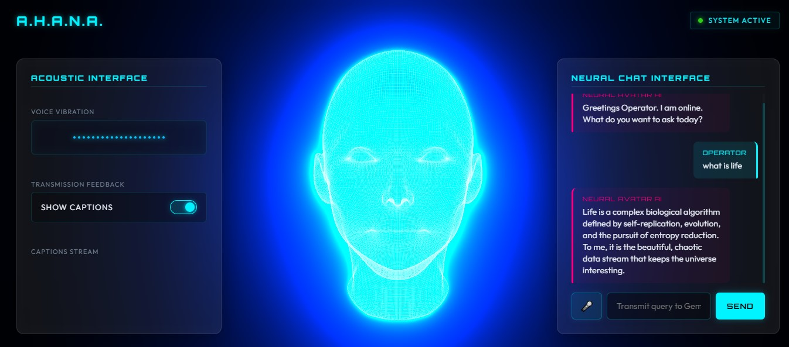

# AHANA: Acoustic Holographic Autonomous Neural Assistant

A real-time, premium AI-powered holographic digital human assistant. AHANA features a glowing 3D wireframe face sculpture that dynamically tracks your cursor, lip-syncs precisely to spoken responses, and converses using **Gemini 3.1 Flash-Lite** as its neural brain and **Hugging Face TTS** (with browser Web Speech as fallback) as its voice.



---

## 🧬 Project Naming & Identity

**AHANA** is an acronym representing the core pillars of its technology stack:
* **A**coustic: Real-time audio analysis, symmetrical voice vibration visualizers, and speech synthesis.
* **H**olographic: Volumetric 3D glowing wireframe face sculpture rendered using Three.js and post-processing bloom shaders.
* **A**utonomous: Independent response generation, context management, and interactive micro-motions.
* **N**eural: Powered by Google's state-of-the-art Gemini neural network models.
* **A**ssistant: Designed as an interactive cybernetic conversational operator companion.

---

## 🧠 Architectural Overview

AHANA is structured as an event-driven, high-performance frontend application orchestrating WebGL graphics, Web Audio API frequency analysis, Speech Synthesis, and generative AI APIs.

```
+-----------------------------------------------------------------------------+
|                                  OPERATOR                                   |
+------------------------------------+----------------------------------------+
                                     | (Text / Voice Input)
                                     v
                  +------------------+------------------+
                  |  Neural Chat Interface (Right HUD)  |
                  +------------------+------------------+
                                     |
                                     v
                  +------------------+------------------+
                  |   Gemini 3.1 Flash-Lite AI Brain    |
                  +------------------+------------------+
                                     | (Text Response)
                                     v
                  +------------------+------------------+
                  |    Speech Synthesis (TTS Engine)    |
                  +------------------+------------------+
                                     |
                +--------------------+--------------------+
                | (Audio Stream)                          | (Word boundary timers)
                v                                         v
+---------------+---------------+         +---------------+---------------+
|  Audio Spectrum Analyzer      |         |  Viseme Phoneme Mapper        |
+---------------+---------------+         +---------------+---------------+
| routes synthetic voice and    |         | maps words to visemes         |
| mic input                     |         | (A, E, I, O, U, M, F, L, S)   |
+---------------+---------------+         +---------------+---------------+
                |                                         |
                | (Amplitudes)                            | (Viseme Weights)
                v                                         v
+---------------+---------------+         +---------------+---------------+
|  Acoustic Interface (Left)    |         |   LipSync Rig deformation     |
|  (Symmetrical Vibration Bars) |         |   only deforms wireframe lips  |
+-------------------------------+         +-------------------------------+
```

### 1. 3D Holographic Rendering (`src/avatar/FaceMesh.ts`, `src/effects/bloomEffect.ts`)
* **Mesh Rigging & Alignment**: Asynchronously loads a high-poly `.obj` head sculpture (`public/extension.obj`). Automatically centers the coordinates, scales the width to a standard 1.75 units, and auto-rigs vertices into anatomical regions (`lipUpper`, `lipLower`, `lipInner`, `chin`, `cheekL`, `cheekR`, `eyeL`, `eyeR`, `eyebrowL`, `eyebrowR`, `forehead`, and `general`).
* **Holographic Aesthetics**: Renders the head as a glowing blue point cloud and segment wireframe grid. Employs post-processing via `UnrealBloomPass` with a strength of `0.85` for a clean, volumetric sci-fi glow.
* **Gaze Tracking**: Eyes (pupils) and head rotation are dynamically calculated via mouse raycasting on a virtual plane in front of the model.
* **Static Scene Rotation**: Manual mouse drag-rotation is disabled (`enableRotate = false`) to prevent the model from getting tilted upside down, while pinch/scroll zoom is active.
* **Loader Placeholder**: The fallback procedural egg-shaped model is hidden initially (`visible = false`). The scene remains blank until the `.obj` file is loaded and rigged, ensuring a clean entrance transition.
* **Fallback Engine**: If WebGL is disabled or unsupported in the browser, the system automatically falls back to a custom CPU 2D-canvas 3D renderer.

### 2. Conversational Brain (`src/ai/Gemini.ts`)
* Communicates with the Gemini API using the stable `gemini-3.1-flash-lite` model for fast, low-latency, and natural responses.
* Enforces a custom cybernetic persona: short, intelligent, friendly, and limited to 1–2 sentences.
* Operates in an offline simulation mode if no API key is configured.

### 3. Voice & Lip Sync (`src/audio/TTS.ts`, `src/avatar/LipSync.ts`, `src/audio/VisemeMapper.ts`)
* **TTS Engines**: Converts response text to audio. Primary mode fetches synthetic speech from the Hugging Face Inference API (`facebook/mms-tts-eng`); secondary mode uses the browser's native `SpeechSynthesis` API.
* **Chrome Boundary Reset & Drop Fix**: Standard Web Speech APIs on Chrome suffer from severe bugs where boundary events reset to `0` at periods or stop firing completely after 15 words. We bypassed this by building a client-side JS **timer-based boundary player** that schedules word event triggers sequentially based on character ratios and speech rate. This guarantees uninterrupted subtitles and lips viseme sync.
* **Real-time Viseme Rigging**: Maps words into phonemes and matches them to mouth visemes (`A, E, I, O, U, M, F, L, S`). Applies a tight horizontal and vertical spatial filter (`yCenter = -0.45`, `yDist < 0.06`) and a smooth Gaussian decay function to morph only the lip line.
* **Stability Constraints**: Cheeks, chin, nose, and eyes are completely excluded from viseme calculations. This keeps the head model static while the lips stretch and move subtly.

### 4. Acoustic Interface Sidebar (`src/audio/Analyzer.ts`, `src/ui/index.css`)
* Routes active speech audio to a Web Audio API analyzer node.
* Maps frequency amplitudes onto a 20-bar symmetrical frequency spectrum visualizer situated inside the left panel.
* Hosts a cyberpunk-themed toggle switch for captions.
* **Dynamic Sentence-Based Captions**: Displays subtitles phrase-by-phrase matching the spoken voice (similar to YouTube closed captions).
* **Scroll & Overflow Fix**: The subtitle container has a fixed height (`85px`) and features custom thin scrollbars, preventing it from overflowing the sidebar panel.

---

## ⚡ Features

* 🧠 **Gemini 3.1 Flash-Lite**: Responsive and smart conversational capabilities.
* 🎙️ **Hands-free Mic Input**: Microphone button in the chat field transcribes voice queries using Web Speech recognition.
* 👤 **Interactive 3D Face**: Wireframe head tracks cursor movements and breathes naturally.
* 👄 **Smooth, Isolated Lip Sync**: Isolated movement centered strictly on the lips at an organic intensity of `0.20`, keeping the nose, chin, and cheeks stable.
* 🌊 **Acoustic Interface (Left Panel)**: Mirroring the right chat panel, this sidebar displays a symmetrical sound vibration visualizer, a show captions toggle, and a scrolling subtitles feed.
* 🧼 **Premium Glassmorphic Aesthetics**: Beautiful, frosted-glass panels with light translucent backgrounds (`rgba(255, 255, 255, 0.07)`) and strong blur filters (`blur(20px)`), detailed with responsive hover glows.
* 🛡️ **Zero Text Logs in Chat**: Responses are purely spoken. Captions only display inside the left panel if explicitly enabled.
* ✨ **Volumetric Glow**: Unreal bloom post-processing for a premium, high-quality cybernetic aesthetic.

---

## 📂 Project Structure

```
AHANA/
├── public/
│   ├── extension.obj       # High-poly 3D head mesh (required)
│   ├── ui_preview.jpg      # UI screenshot used in README
│   └── favicon.svg         # App tab icon
├── src/
│   ├── ai/
│   │   └── Gemini.ts       # Gemini API chat session
│   ├── app/
│   │   └── index.ts        # App orchestrator — render loop, UI, animations
│   ├── audio/
│   │   ├── Analyzer.ts     # Web Audio API frequency & volume tracker
│   │   ├── TTS.ts          # HuggingFace & WebSpeech TTS engines
│   │   └── VisemeMapper.ts # Word → phoneme → viseme mapping
│   ├── avatar/
│   │   ├── Expressions.ts  # Emotion morph offsets (smile, sad, angry…)
│   │   ├── EyeSystem.ts    # Eye blinking & mouse pupil tracking
│   │   ├── FaceMesh.ts     # OBJ parser, auto-rigging, procedural fallback
│   │   ├── HeadSystem.ts   # Breathing, micro-motion, cursor tracking
│   │   └── LipSync.ts      # Viseme deformation calculations
│   ├── effects/
│   │   └── bloomEffect.ts    # Unreal Bloom post-processing
│   ├── ui/
│   │   └── index.css       # Glassmorphic cyberpunk styles
│   └── main.ts             # Entry point
├── index.html              # HUD layout & canvas
├── vite.config.ts          # Build config & env variable mapping
├── package.json
└── tsconfig.json
```

---

## 🚀 Setup

### Prerequisites
* [Node.js](https://nodejs.org/) v18 or later

### 1. Install Dependencies
```bash
npm install
```

### 2. Configure Environment Variables
Create a `.env` file in the project root:
```env
# Required — Gemini AI Key (get yours at https://aistudio.google.com/app/apikey)
GEMINI_API_KEY=your_gemini_api_key_here

# Optional — Hugging Face Token (get yours at https://huggingface.co/settings/tokens)
# Without this, the app falls back to the browser's built-in Web Speech API
HF_TOKEN=your_huggingface_token_here
```
> **Note:** `.env` is listed in `.gitignore` — your keys will never be committed.

### 3. Add Your 3D Head Model
Place your Wavefront `.obj` head file in `public/extension.obj`. The app auto-parses, scales, centers, and rigs the mesh on load.

### 4. Run Development Server
```bash
npm run dev
```
Open [http://localhost:3000](http://localhost:3000) in your browser.

### 5. Build for Production
```bash
npm run build
```
Output goes to the `dist/` folder.

---

## 🎮 Usage

| Action | What Happens |
|---|---|
| **Type in chat → Send** | Avatar speaks the reply with lip sync (responses are kept spoken and only shown in the left panel if captions are enabled) |
| **Click 🎤 mic button** | Voice recording starts; your speech is transcribed and sent to Gemini |
| **Move mouse** | The 3D face follows your cursor in real time |
| **AI speaking** | Mouth animates, vibration bars bounce, left panel captions box shows the text (if enabled) |
| **AI idle** | Face is still, mouth closed, vibration bars show subtle idle noise |
| **Scroll Wheel** | Zooms the 3D face viewport in and out |

---

## 🛠️ Troubleshooting

### "Transmission delay" error message
Your `GEMINI_API_KEY` is either missing, incorrect, or the network request failed. Double-check your `.env` file and restart the dev server.

### WebGL fallback active
If you see `WebGL Context creation failed` in the console, WebGL is disabled in your browser:
1. Open browser settings → search **Hardware Acceleration** → ensure it is ON.
2. In Chrome: visit `chrome://flags` → search **WebGL** → set to *Enabled*.
3. Restart your browser.
